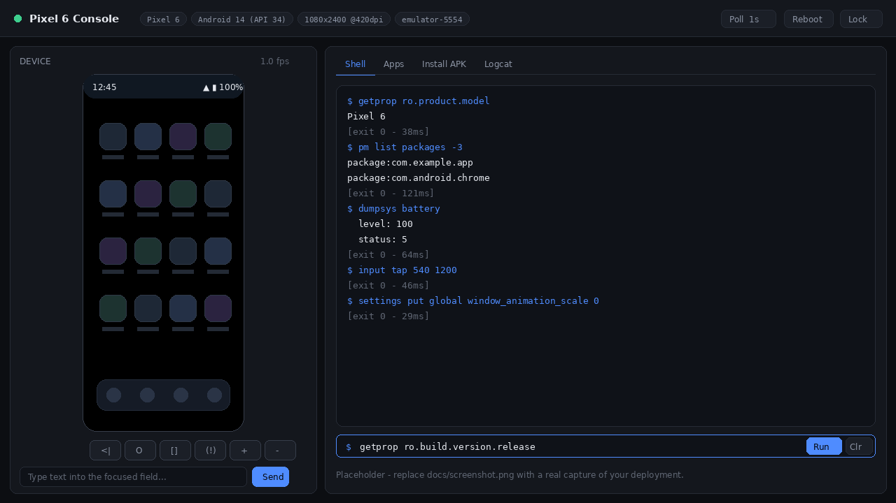

# Android Emulator (Pixel 6) in Docker — REST API + Web Console

A single container that boots a **headless Google Pixel 6 Android emulator**, built from
the **official Android SDK command-line tools** (no third-party emulator image is
wrapped), and exposes it two ways: a token-authenticated **REST API** for `adb shell`,
APK installation, screenshots, input and logcat; and a dependency-free **web console**
that streams the device screen, forwards taps/swipes/typing, installs APKs by drag &
drop, and tails logcat live. It is designed to be built once in GitHub Actions, pushed
to GHCR, and deployed as a **Docker Compose stack on Dokploy** behind Traefik — with
`/dev/kvm` passed through and **`--privileged` never required**.


<!-- Placeholder: run the stack, open the UI, and drop a screenshot at docs/screenshot.png -->

---

## Table of contents

- [Requirements — read the KVM section first](#requirements)
- [Quick start (local)](#quick-start-local)
- [Deploying on Dokploy](#deploying-on-dokploy)
- [Environment variables](#environment-variables)
- [API reference](#api-reference)
- [Web console](#web-console)
- [Security](#security)
- [How it is built](#how-it-is-built)
- [Troubleshooting](#troubleshooting)
- [Development](#development)
- [License](#license)

---

## Requirements

### ⚠️ KVM is mandatory — check this before anything else

The Android emulator without hardware acceleration is roughly twenty times slower and
**will not finish booting inside the default timeout**. This image therefore refuses to
start without a usable `/dev/kvm` and prints an actionable error instead of limping
along silently.

Run these on the **host**, not in the container:

```bash
# 1. Does the CPU support virtualisation, and is it enabled in the BIOS/firmware?
egrep -c '(vmx|svm)' /proc/cpuinfo     # must print a number > 0

# 2. Does the device node exist?
ls -l /dev/kvm                         # e.g. crw-rw---- 1 root kvm 10, 232 ... /dev/kvm

# 3. Is the module loaded?
lsmod | grep kvm
sudo modprobe kvm_intel                # or kvm_amd

# 4. Can a container actually open it?
docker run --rm --device /dev/kvm ubuntu:24.04 test -w /dev/kvm && echo "KVM OK"
```

> **Most ordinary VPS plans will fail step 2 or 4.**
> Shared/virtualised hosting (OpenVZ, LXC, and the majority of KVM-on-KVM budget VPS
> offerings) does **not** expose nested virtualisation, so `/dev/kvm` is simply absent
> inside your VM. You need one of:
> - a **bare-metal / dedicated** server (Hetzner dedicated, OVH bare metal, …), or
> - a cloud instance with nested virtualisation explicitly enabled
>   (GCP nested-virt licence, AWS `*.metal` instances, Azure `Dv3`/`Ev3` families).
>
> No amount of Docker flags can create KVM where the hypervisor does not offer it.

### Minimum host resources

| Resource | Minimum | Comfortable |
|---|---|---|
| CPU | 4 cores (x86_64) | 8 cores |
| RAM | 8 GB | 16 GB |
| Disk | 30 GB free | 50 GB free |
| Kernel | Linux with KVM | — |
| Arch | **x86_64 only** | — |

The image itself is ~8–10 GB (the `google_apis;x86_64` system image dominates), the AVD
userdata volume grows to several GB, and the emulator wants 4 GB of guest RAM plus a
2 GB `/dev/shm`.

`arm64` hosts are **not** supported by this configuration — swap `SYSTEM_IMAGE_ABI` to
`arm64-v8a` and rebuild if you want to try, but the Pixel 6 `google_apis` arm images are
not maintained with the same coverage.

---

## Quick start (local)

```bash
git clone https://github.com/shadeofsun/android-on-the-web.git
cd android-on-the-web

cp .env.example .env
# Generate a real token and put it in .env
openssl rand -hex 32
$EDITOR .env            # set API_TOKEN, and IMAGE or uncomment the build: block

docker compose up -d
docker compose logs -f android
```

Watch for:

```
[check-kvm] OK - /dev/kvm is present and writable ...
[wait-for-boot] still booting... 40s/300s (sys.boot_completed='', bootanim='running')
[wait-for-boot] boot completed in 96s.
[entrypoint] device is ready. Serial: emulator-5554
[entrypoint] starting API on 0.0.0.0:8080 (shell mode: allowlist)
```

Then:

```bash
curl -s localhost:8080/api/health | jq
open http://localhost:8080        # the web console
```

Cold boot on a decent host is typically **60–150 seconds**; the healthcheck
`start_period` allows 300 s.

To build locally instead of pulling from GHCR, uncomment the `build:` block in
`docker-compose.yml` and run `docker compose up --build` (expect 15–30 minutes and
~15 GB of build cache on the first run).

---

## Deploying on Dokploy

Dokploy is used in **Compose** mode because `devices: /dev/kvm` cannot be expressed in
Dokploy's simpler "Application" type.

1. **Publish the image.** Push to `main`; `.github/workflows/build.yml` builds and pushes
   `ghcr.io/shadeofsun/android-on-the-web:latest` plus `sha-<short>` and semver tags. Make the GHCR package
   public, or add a registry credential in Dokploy → *Settings → Registry*.

2. **Create the project.**
   Dokploy → **Create Project** → **Compose**.
   *Provider:* GitHub → select the repository and branch `main`.
   *Compose Path:* `docker-compose.yml`.

3. **Set the environment.** In the project's **Environment** tab paste:

   ```env
   API_TOKEN=<output of: openssl rand -hex 32>
   IMAGE=ghcr.io/shadeofsun/android-on-the-web:latest
   DOMAIN=android.your-domain.com
   EMULATOR_RAM=4096
   EMULATOR_CORES=4
   BOOT_TIMEOUT=300
   SHELL_MODE=allowlist
   MAX_APK_MB=200
   ```

   These are the values interpolated by `docker-compose.yml`. **Never** commit them.

4. **Point DNS.** Create an `A` record for `android.your-domain.com` at the server's IP.

5. **Domain / TLS.** The Traefik labels in `docker-compose.yml` already declare the
   router, the HTTP→HTTPS redirect and `certresolver=letsencrypt`. If your Dokploy
   installation names its resolver differently, edit
   `traefik.http.routers.android.tls.certresolver`. Alternatively, remove the labels and
   add the domain through Dokploy → **Domains** (service `android`, port `8080`).

6. **Verify the network.** The compose file joins the external `dokploy-network`, which
   Dokploy creates during installation. Confirm with `docker network ls | grep dokploy`.

7. **Deploy.** Click **Deploy**, then watch the logs for `boot completed`. The first
   deployment also has to pull ~8 GB, so allow time.

8. **Smoke test.**

   ```bash
   curl -s https://android.your-domain.com/api/health | jq
   ```

### Dokploy specifics worth knowing

- **Increase the deployment timeout** if the UI marks the service unhealthy while it is
  still pulling; the container healthcheck has a 300 s `start_period`.
- **The `avd-data` volume persists installed apps** across redeploys. To reset the
  device, set `WIPE_DATA=true` and redeploy once (then set it back to `false`), or delete
  the volume.
- **One emulator per container.** Scaling replicas will not work — they would all
  contend for the same AVD volume. Deploy separate stacks with separate volumes instead.

---

## Environment variables

### Runtime (set in `.env` or the Dokploy environment editor)

| Variable | Default | Description |
|---|---|---|
| `API_TOKEN` | *(none — required)* | Bearer token for every authenticated endpoint. The service **refuses to start** without it. Minimum 16 chars. |
| `IMAGE` | `ghcr.io/shadeofsun/android-on-the-web:latest` | Image the compose stack pulls. |
| `DOMAIN` | `android.example.com` | Hostname used in the Traefik router rule. |
| `EMULATOR_RAM` | `4096` | Guest RAM in MB (`-qemu -m`). Must fit inside the container memory limit. |
| `EMULATOR_CORES` | `4` | Guest vCPUs (`-qemu -smp`). |
| `BOOT_TIMEOUT` | `300` | Seconds to wait for `sys.boot_completed=1` before failing the start. |
| `WIPE_DATA` | `false` | `true` adds `-wipe-data`, resetting userdata at every start. |
| `DISABLE_ANIMATIONS` | `true` | Zero the window/transition/animator scales after boot. |
| `EMULATOR_EXTRA_ARGS` | *(empty)* | Extra emulator flags, space-separated (e.g. `-writable-system`). |
| `SHELL_MODE` | `allowlist` | `allowlist` or `unrestricted`. See [Security](#security). |
| `SHELL_ALLOWED_BINARIES` | see below | Comma-separated override of the permitted first binary. |
| `SHELL_TIMEOUT` | `30` | Per-command timeout in seconds for `/api/shell`. |
| `MAX_APK_MB` | `200` | Upload cap for `/api/install`. |
| `INSTALL_TIMEOUT` | `300` | Timeout for `adb install` in seconds. |
| `RATE_LIMIT` | `60/minute` | Per-IP limit (slowapi syntax). Input and screenshot routes use higher dedicated limits. |
| `RATE_LIMIT_ENABLED` | `true` | Set `false` only on a private network. |
| `LOG_LEVEL` | `info` | uvicorn log level. |
| `ADB_SERIAL` | `emulator-5554` | Serial pinned on every `adb` call. |
| `ADB_TIMEOUT` | `30` | Default adb timeout in seconds. |
| `SCREENSHOT_TIMEOUT` | `30` | Timeout for `exec-out screencap -p`. |
| `LOGCAT_MAX_LINES` | `5000` | Lines a single SSE connection emits before closing. |
| `API_HOST` / `API_PORT` | `0.0.0.0` / `8080` | Bind address inside the container. |
| `WEB_DIR` | `/opt/app/web` | Static UI directory. |
| `ADB_PROP_<name>` | *(none)* | Sets a device property after boot; underscores become dots (`ADB_PROP_debug_foo=1` → `setprop debug.foo 1`). |
| `EXTRA_SETTINGS_CMDS` | *(none)* | Semicolon-separated `adb shell` commands run once after boot. |

Default `SHELL_ALLOWED_BINARIES`:

```
pm, am, input, dumpsys, getprop, setprop, settings, screencap,
wm, ls, cat, cmd, monkey, logcat, ps, df
```

### Build args (`--build-arg`, or the workflow's `build-args`)

| Arg | Default | Description |
|---|---|---|
| `CMDLINE_TOOLS_VERSION` | `11076708` | Android command-line tools build number. |
| `CMDLINE_TOOLS_URL` | `https://dl.google.com/android/repository/commandlinetools-linux-11076708_latest.zip` | Download URL, pinned to the version above. |
| `CMDLINE_TOOLS_SHA256` | `2d2d5085…e5e258` | Verified at build time. Set to `""` to skip (not recommended). |
| `ANDROID_API` | `34` | API level of the system image. |
| `IMAGE_TYPE` | `google_apis` | `google_apis` or `google_apis_playstore` (the latter has no `adb root`). |
| `SYSTEM_IMAGE_ABI` | `x86_64` | Guest ABI. |
| `AVD_NAME` | `pixel6` | AVD name; the compose volume path must match. |
| `AVD_DEVICE` | `pixel_6` | `avdmanager` device profile. |
| `KVM_GID` | `104` | Initial gid for the `kvm` group; realigned at runtime from the host device. |

**Updating the command-line tools:** take the new URL from
<https://developer.android.com/studio#command-line-tools-only>, download it, run
`sha256sum` on the zip, and pass both as build args. The build fails loudly on a
checksum mismatch rather than shipping an unverified toolchain.

---

## API reference

Base URL: `https://android.your-domain.com` (or `http://localhost:8080` locally).
Every endpoint **except `/api/health`** requires `Authorization: Bearer $API_TOKEN`.
Interactive docs are at `/docs`; the OpenAPI schema at `/openapi.json`.

```bash
export BASE=http://localhost:8080
export TOKEN=your-api-token
export AUTH="Authorization: Bearer $TOKEN"
```

| Method | Path | Auth | Description |
|---|---|:--:|---|
| `GET` | `/api/health` | — | Boot state, device state, API uptime, shell mode |
| `GET` | `/api/device` | ✔ | Model, Android version, serial, resolution, density |
| `POST` | `/api/shell` | ✔ | Run a command in the device shell |
| `POST` | `/api/install` | ✔ | Upload an APK (multipart) and `adb install -r` |
| `DELETE` | `/api/app/{package}` | ✔ | Uninstall a package |
| `GET` | `/api/apps` | ✔ | List installed packages |
| `GET` | `/api/screenshot` | ✔ | Raw PNG of the framebuffer |
| `POST` | `/api/input/tap` | ✔ | Tap at `(x, y)` |
| `POST` | `/api/input/swipe` | ✔ | Swipe `(x1,y1) → (x2,y2)` over `ms` |
| `POST` | `/api/input/text` | ✔ | Type text into the focused field |
| `POST` | `/api/input/key` | ✔ | Send a keycode |
| `GET` | `/api/logcat` | ✔ | Live logcat as Server-Sent Events |
| `POST` | `/api/reboot` | ✔ | Reboot the device |

### Health

```bash
curl -s $BASE/api/health
```
```json
{"status":"ready","boot_completed":true,"device_state":"device",
 "serial":"emulator-5554","api_uptime_seconds":412,"shell_mode":"allowlist"}
```

### Device

```bash
curl -s -H "$AUTH" $BASE/api/device
```
```json
{"serial":"emulator-5554","state":"device","model":"Pixel 6",
 "manufacturer":"Google","device":"pixel_6","android_version":"14","sdk_int":34,
 "build_id":"UE1A.230829.036","abi":"x86_64",
 "screen_width":1080,"screen_height":2400,"density":420,"boot_completed":true}
```

### Shell

```bash
curl -s -H "$AUTH" -H 'Content-Type: application/json' \
  -d '{"cmd":"getprop ro.product.model"}' \
  $BASE/api/shell
```
```json
{"cmd":"getprop ro.product.model","exit_code":0,
 "stdout":"Pixel 6\n","stderr":"","duration_ms":38}
```

Rejected in `allowlist` mode (HTTP 403):

```bash
curl -s -H "$AUTH" -H 'Content-Type: application/json' \
  -d '{"cmd":"getprop x; rm -rf /"}' $BASE/api/shell
# {"detail":"Character sequence ';' is not permitted in SHELL_MODE=allowlist. ..."}
```

### Install an APK

```bash
curl -s -H "$AUTH" -F "file=@app-debug.apk" $BASE/api/install
```
```json
{"ok":true,"filename":"app-debug.apk","size_bytes":8123456,"output":"Success"}
```

### Uninstall

```bash
curl -s -X DELETE -H "$AUTH" $BASE/api/app/com.example.app
```

### List packages

```bash
curl -s -H "$AUTH" "$BASE/api/apps"                       # third-party only
curl -s -H "$AUTH" "$BASE/api/apps?include_system=true"   # everything
```

### Screenshot

```bash
curl -s -H "$AUTH" $BASE/api/screenshot -o screen.png
```

### Input

```bash
curl -s -H "$AUTH" -H 'Content-Type: application/json' \
  -d '{"x":540,"y":1200}' $BASE/api/input/tap

curl -s -H "$AUTH" -H 'Content-Type: application/json' \
  -d '{"x1":540,"y1":1800,"x2":540,"y2":600,"ms":300}' $BASE/api/input/swipe

curl -s -H "$AUTH" -H 'Content-Type: application/json' \
  -d '{"text":"hello world"}' $BASE/api/input/text

curl -s -H "$AUTH" -H 'Content-Type: application/json' \
  -d '{"keycode":"KEYCODE_HOME"}' $BASE/api/input/key
```

`input/text` accepts printable ASCII; spaces are encoded as `%s` for `input text`
automatically. Use `input/key` for `KEYCODE_ENTER`, `KEYCODE_BACK`, `KEYCODE_DEL`,
`KEYCODE_APP_SWITCH`, and so on.

### Logcat (SSE)

```bash
curl -N -H "$AUTH" "$BASE/api/logcat?filters=ActivityManager:I,*:E"

# EventSource cannot set headers, so a query token is also accepted:
curl -N "$BASE/api/logcat?token=$TOKEN&clear=true"
```
```
event: status
data: connected

data: 08-22 04:11:02.114  1543  1543 I ActivityManager: Start proc ...
```

### Reboot

```bash
curl -s -X POST -H "$AUTH" $BASE/api/reboot
# then poll /api/health until boot_completed is true
```

### Status codes

| Code | Meaning |
|---|---|
| `400` | Invalid argument (bad package name, malformed keycode, non-ASCII text, bad logcat filter) |
| `401` | Missing or wrong token |
| `403` | Shell command rejected by the allowlist |
| `413` | APK exceeds `MAX_APK_MB` |
| `429` | Rate limit exceeded (`X-RateLimit-*` headers describe the budget) |
| `502` | adb reported a failure |
| `503` | adb binary missing / device not attached |
| `504` | Command exceeded its timeout |

---

## Web console

Open the deployed domain in a browser and paste the `API_TOKEN`.

- **Live screen** — polls `/api/screenshot` (interval selectable: off / 0.5 s / 1 s / 2 s /
  5 s). Clicking maps display coordinates to device pixels through the `object-fit:
  contain` letterbox, so taps land where you click at any window size. Dragging becomes a
  swipe. Polling pauses automatically when the tab is hidden and backs off while the
  device is unreachable.
- **Navigation bar** — Back / Home / Recents / Power / Volume.
- **Text input** — sends to `/api/input/text`, plus Enter and Backspace buttons.
- **Terminal** — `/api/shell` with `↑`/`↓` command history, exit code and duration.
- **Apps** — list, filter, launch, force-stop and uninstall packages.
- **Install APK** — drag & drop (or file picker) with a real upload progress bar via
  `XMLHttpRequest`.
- **Logcat** — live SSE stream with level colouring and a filter box.

Vanilla JS, no build step, no framework, **no external CDN**. The token is held in
`sessionStorage` only (never `localStorage`) and is dropped when the tab closes or you
press **Lock**.

---

## Security

**Generate a real token.** Anything with `API_TOKEN` can execute shell commands on the
device and install arbitrary APKs.

```bash
openssl rand -hex 32
```

The token is compared with `secrets.compare_digest`. If `API_TOKEN` is unset or shorter
than 16 characters the service **exits at startup** — there is no "insecure fallback"
mode.

**adb is never exposed.** Ports `5554`/`5555` are not published in `docker-compose.yml`.
Only `8080` reaches Traefik. If you must attach a local adb for debugging, tunnel it —
never bind it to a public interface:

```yaml
# docker-compose.yml — DEBUG ONLY, loopback binding
ports:
  - "127.0.0.1:5555:5555"
```
```bash
ssh -L 5555:127.0.0.1:5555 user@server
adb connect 127.0.0.1:5555
```

**`/api/shell` uses an allowlist, not a blocklist.**

- Only the *first* binary is checked, against `SHELL_ALLOWED_BINARIES`.
- `;`, `&`, `|`, `` ` ``, `$(`, `${`, `>`, `<`, `\`, newline and carriage return are
  rejected before tokenisation.
- The command is split with `shlex.split` and every token is re-quoted with
  `shlex.quote` before it reaches the device shell, so arguments cannot be reinterpreted
  as syntax.
- `subprocess` is always called with an **argument list**; `shell=True` appears nowhere
  in the codebase.
- Every command has a timeout (`SHELL_TIMEOUT`, default 30 s).

> **`SHELL_MODE=unrestricted` disables all of that.** The raw string is handed to the
> device shell. The API prints a large banner at startup and the web console shows a
> `SHELL: UNRESTRICTED` badge. Only enable it on a trusted, network-isolated deployment,
> and treat `API_TOKEN` as a root credential for the device.

**Other hardening in place**

- Per-IP rate limiting via `slowapi` (`60/minute` default; `300/minute` for input and
  screenshots, `10/minute` for installs, `5/minute` for reboots), with `X-RateLimit-*`
  response headers.
- APK uploads are streamed to a temp file, capped at `MAX_APK_MB`, checked for a ZIP
  magic number, and deleted afterwards.
- Package names, keycodes and logcat filters are validated against strict regexes.
- The container runs as the unprivileged `androiduser`. It starts as root **only** to
  align the `kvm` group gid with the host device node, then drops privileges with
  `gosu`. `--privileged` and `cap_add` are not used.
- `.gitignore` and `.dockerignore` exclude `.env`, keys and keystores. **No secret is
  committed to this repository** — `.env.example` contains placeholders only.

**Recommended additions for a public deployment:** put Traefik BasicAuth or an
IP-allowlist middleware in front of the router, and keep the domain off public DNS
indexes.

---

## How it is built

```
Dockerfile              ubuntu:24.04 → JDK 17 → cmdline-tools (pinned+checksummed)
                        → platform-tools + emulator → system image (own layer)
                        → AVD template → python venv → app code
scripts/entrypoint.sh   root: align kvm gid, seed volume → gosu androiduser
                        → check-kvm → adb → emulator → wait-for-boot → uvicorn
scripts/check-kvm.sh    fails with a diagnostic wall of text if KVM is unusable
scripts/wait-for-boot.sh adb wait-for-device + sys.boot_completed polling with progress
api/config.py           env → frozen Settings, fail-fast validation
api/auth.py             HTTPBearer + secrets.compare_digest
api/adb.py              every adb call; typed exceptions; shell allowlist policy
api/main.py             FastAPI routes, rate limits, SSE, static UI mount
web/                    vanilla HTML/CSS/JS console
```

**Layer ordering.** The multi-GB system image is installed in its own `RUN` after the
smaller SDK components, and the Python/app layers come last, so editing `api/main.py`
rebuilds in seconds rather than re-downloading Android. CI caches with
`type=gha,mode=max`.

**AVD seeding.** The AVD is created at build time into `/opt/avd-template`. A named
volume mounted at `~/.android/avd/pixel6.avd` would otherwise shadow it, so the
entrypoint copies the template into the volume the first time it finds it empty and
rewrites the `pixel6.ini` pointer on every start.

**AVD tuning** patched into `config.ini`: 4096 MB RAM, 576 MB heap, 8192 MB data
partition, hardware keyboard, 1080×2400 @ 420 dpi, `swiftshader_indirect` GPU.

**Emulator flags:** `-no-window -no-audio -no-boot-anim -gpu swiftshader_indirect
-accel on -netdelay none -netspeed full -no-snapshot-save -camera-back none
-camera-front none -qemu -m $EMULATOR_RAM -smp $EMULATOR_CORES`.

**Shutdown.** `SIGTERM` is trapped: the API is stopped, then `adb emu kill` powers the
device down cleanly (with a SIGTERM/SIGKILL escalation after 30 s) so the userdata image
is not corrupted. `stop_grace_period: 60s` gives it room.

---

## Troubleshooting

### `FATAL: /dev/kvm is not usable inside this container`

Work through the [KVM checklist](#requirements). In order of likelihood:

1. The host is a VPS without nested virtualisation → **move to bare metal**. Nothing else
   will fix this.
2. `devices: - /dev/kvm:/dev/kvm` is missing from the compose file.
3. Virtualisation is disabled in the BIOS (`egrep -c '(vmx|svm)' /proc/cpuinfo` prints 0).
4. The kvm module is not loaded → `sudo modprobe kvm_intel` (or `kvm_amd`).
5. Host permissions: `sudo chmod 666 /dev/kvm` as a quick test, or better,
   `sudo usermod -aG kvm $USER`. The entrypoint already realigns the container's `kvm`
   gid to whatever the host device uses, so this is rarely the cause.

### Boot times out (`ERROR: boot did not complete within 300s`)

- Raise `BOOT_TIMEOUT` (e.g. `600`) — cold first boots on a busy host are slow.
- Confirm acceleration is real: `docker compose exec android emulator -accel-check`.
- Give it more CPU: `EMULATOR_CORES=4` or more, and check the host is not saturated.
- A corrupted userdata image from a hard kill: set `WIPE_DATA=true`, deploy once, set it
  back to `false`. Or `docker volume rm <stack>_avd-data`.
- Look for QEMU errors: `docker compose logs android | grep -i '\[emulator\]'`.

### Out of memory / the container is OOM-killed

`EMULATOR_RAM` is *guest* RAM; the container needs that **plus** ~2 GB for QEMU, the
JVM tooling and Python. With the default `EMULATOR_RAM=4096` keep the compose memory
limit at 8 G. If the host has only 8 GB total, lower `EMULATOR_RAM` to `2048` and the
limit to `4G` — expect a slower device.

Check with `docker stats android-emulator`, and `dmesg | grep -i oom` on the host.

### The image is huge / the build runs out of disk

Expect ~8–10 GB compressed. The GitHub Actions job frees ~14 GB of preinstalled runner
tooling before building; if it still fails, drop to a smaller system image
(`ANDROID_API=30`) or use a larger runner. On the server, `docker system prune -af`
between deployments reclaims old image layers.

### `502 Bad Gateway` from Traefik

The container is up but the API is not listening yet — the emulator is still booting.
Check `docker compose logs -f android` and wait for `boot completed`. The healthcheck's
300 s `start_period` is intentional.

### The screen in the UI is black or frozen

- The device may still be booting — the status dot is amber during boot, green when ready.
- Check `/api/screenshot` directly: `curl -H "$AUTH" $BASE/api/screenshot -o s.png`.
- The screen may genuinely be off: send `KEYCODE_WAKEUP`, or the Power button in the UI.

### Logcat stream disconnects immediately

Traefik must not buffer SSE. The compose labels set
`responseforwarding.flushinterval=100ms`; keep them. Also note a single stream closes
after `LOGCAT_MAX_LINES` lines by design — the UI reconnects when you press Start again.

### `429 Too Many Requests` while polling the screen

Screenshots have their own `300/minute` budget, which is ample for 1 s polling. If you
are also hammering `/api/shell`, raise `RATE_LIMIT`.

### Apps disappear after a redeploy

The `avd-data` volume was recreated, or `WIPE_DATA=true` is still set. Check
`docker volume ls` and the environment.

---

## Development

```bash
# Lint exactly as CI does
pip install ruff==0.8.4
ruff check api/ && ruff format --check api/

sudo apt-get install -y shellcheck
shellcheck --severity=style --shell=bash scripts/*.sh

# Validate the compose file
API_TOKEN=dummy-token-for-validation docker compose config -q
```

Run the API against a real device without rebuilding the image:

```bash
python3 -m venv .venv && . .venv/bin/activate
pip install -r api/requirements.txt
API_TOKEN=dev-token-at-least-16-chars WEB_DIR=./web \
  uvicorn api.main:app --reload --port 8080
```

`api/adb.py` is the only module that shells out; point `ADB_BINARY` at a stub script to
exercise the API offline.

---

## License

MIT — see [LICENSE](LICENSE).

Android is a trademark of Google LLC. This project downloads the official Android SDK
components at build time; your use of them is governed by the
[Android SDK Terms and Conditions](https://developer.android.com/studio/terms).
